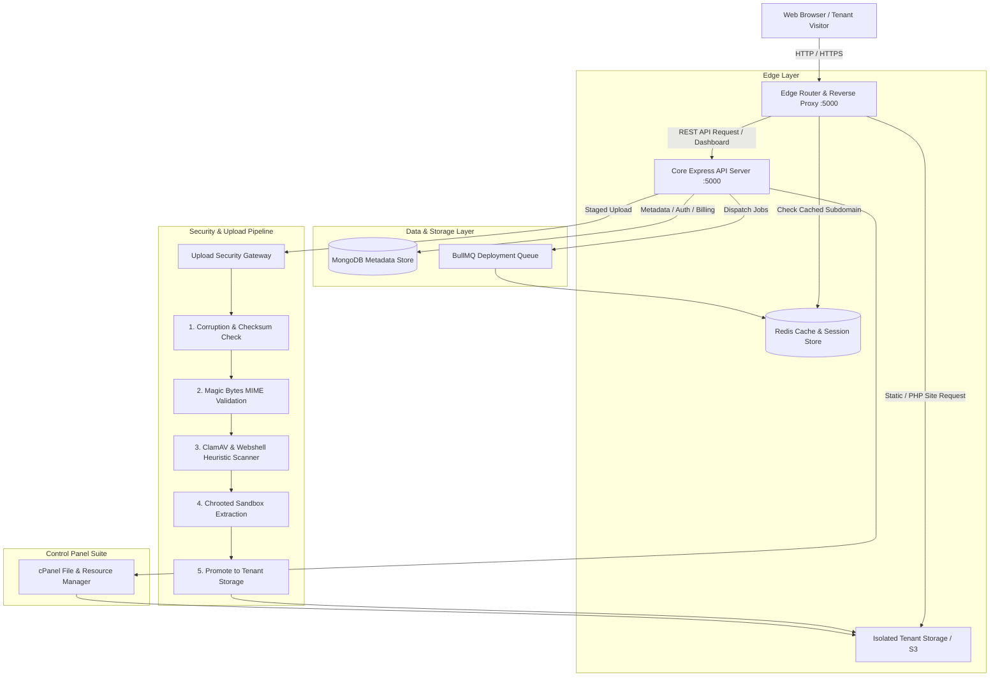
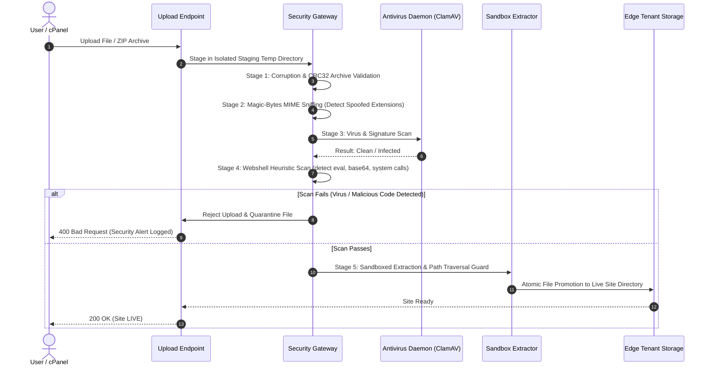

# DeployHub — High-Level Design (HLD) Architecture

## 1. Executive Summary & Architecture Goals
DeployHub is an enterprise-grade, multi-tenant developer deployment and hosting platform. It provides instant hosting for Static (HTML/CSS/JS), React/Vite SPAs, and isolated PHP applications.

### Core Architectural Principles:
1. **Zero-Trust File Upload & Antivirus Protection**: Every uploaded file or archive must pass checksum validation, magic-byte MIME sniffing, archive integrity checks, malware/virus scanning (ClamAV / signature scanning), and heuristic webshell detection before reaching storage.
2. **Strict Storage Decoupling**: The database (MongoDB) is dedicated strictly to metadata, access control, audit logs, and analytics. It **never** stores binary blobs or hosted website code. Website code is managed in an isolated tenant filesystem or S3-compatible Object Storage.
3. **High-Performance Redis Caching**: Subdomain-to-tenant route resolutions, rate limits, and deployment job queues reside in Redis to achieve sub-millisecond edge routing without querying MongoDB on every HTTP request.
4. **Professional cPanel Management Suite**: Full-featured web-based control panel providing file navigation, inline code editing, compression/decompression, access logs, and tenant isolation.

---

## 2. High-Level Architecture Diagram



---

## 3. Storage Decoupling Architecture

### Problem Statement
Storing code files, uploads, and assets inside relational or document databases (e.g. MongoDB GridFS or Base64 documents) leads to bloated database backups, high memory pressure, uncacheable I/O, and extreme performance degradation.

### Solution: Clear Tier Separation
```
┌─────────────────────────────────┐      ┌─────────────────────────────────┐
│     MongoDB (Metadata Store)    │      │  Tenant Storage (Object / Disk) │
├─────────────────────────────────┼──────┼─────────────────────────────────┤
│ • User Accounts & Roles         │      │ • Extracted HTML, CSS, JS, PHP  │
│ • Project Config & Custom Domains│     │ • Uploaded Assets (Images/Media)│
│ • Deployment History & Logs     │      │ • Versioned Build Artifacts     │
│ • Subscription & Storage Quotas │      │ • Raw Staged Archives (temp)    │
│ • File Index & Metadata Catalog │      │ • Static Edge Serving Directories│
└─────────────────────────────────┘      └─────────────────────────────────┘
```

1. **Database Responsibilities**:
   - Stores project records, user auth, deployment statuses, audit trails, and aggregate storage quota counters (`storageUsed`).
2. **Tenant Storage Responsibilities**:
   - Sandboxed local directory (`/app/storage/sites/<project-slug>/`) or S3 bucket (`s3://deployhub-tenants/<user-id>/<project-id>/`).
   - Read-only serving by default for static files, with sandboxed execution permissions for PHP.

---

## 4. Multi-Layer Upload Security & Antivirus Pipeline

Every uploaded file or archive (`.zip`, `.rar`, `.html`, `.php`) passes through an uncompromising 5-stage security pipeline:



### Security Defenses:
1. **Corruption & Archive Integrity Check**:
   - Validates ZIP Central Directory and headers before reading. Corrupt archives are aborted immediately.
2. **Magic-Byte Sniffing**:
   - Analyzes file header bytes (`PK\x03\x04` for ZIP, `Rar!\x1a\x07` for RAR, `GIF89a`, `\x89PNG` etc.) to guarantee an `.exe` renamed as `.png` or `.zip` is rejected.
3. **Antivirus & Malware Scanning**:
   - Integrates ClamAV via daemon socket (`clamd`) or fallback heuristic signature engine.
   - Detects known malware, trojans, ransomware, and web exploits.
4. **Webshell & Backdoor Heuristic Detection**:
   - Scans text and PHP source code for dangerous patterns:
     - `eval(base64_decode(...))`
     - `system(`, `shell_exec(`, `passthru(`, `popen(`
     - PHP obfuscation techniques and PHP tags masquerading inside image files (polyglot files).
5. **ZIP Bomb Explosion Guard**:
   - Maximum decompression ratio of 100:1.
   - Total uncompressed size strictly verified against tenant user plan quota.
6. **Path Traversal & Chroot Boundary**:
   - Disallows `../`, `..\`, absolute paths, symlinks, or drive letters.

---

## 5. Redis Caching & Edge Routing

To serve thousands of subdomains (`project.pateldeeep.me`) and custom domains at wire speed without querying MongoDB on every HTTP packet:

```mermaid
graph LR
    Req["Incoming Request: demo.pateldeeep.me"] --> Router["Edge Router"]
    Router -->|1. Query Cache| Redis[("Redis RAM Cache")]
    Redis -- Cache Hit -->|Project Slug & Storage Path| Serve["Serve from Disk / S3"]
    Redis -- Cache Miss --> QueryDB[("MongoDB")]
    QueryDB -->|Fetch & Cache for 5 mins| Redis
```

### Redis Key Schemas:
- **`edge:domain:<hostname>`**: Maps custom domain (e.g. `clientdomain.com`) to `{ projectId, slug, status }` (TTL: 10 mins).
- **`edge:subdomain:<subdomain>`**: Maps tenant subdomain (e.g. `portfolio`) to `{ projectId, slug, status }` (TTL: 10 mins).
- **`ratelimit:ip:<ip_address>`**: Sliding window rate-limiting counters.
- **`queue:deployments`**: BullMQ distributed queue for background builds and scans.

---

## 6. Professional cPanel Feature Matrix

The redesigned cPanel gives developers an interface comparable to modern hosting dashboards (cPanel / Vercel / Netlify):

| Module | Features & Capabilities |
|---|---|
| **File Manager** | Split-pane file browser, breadcrumb navigation, search, multiselect, drag-and-drop upload. |
| **Code Editor** | Full-screen code editor with syntax highlighting (HTML, CSS, JS, PHP, JSON), line numbering, auto-save, and keyboard shortcuts. |
| **Archive Tools** | One-click ZIP compression of selected directories, safe in-place extraction of ZIP/RAR with auto-flattening of nested folders. |
| **Security & Permissions** | File permissions (644 for files, 755 for directories), file integrity checks, quarantine log. |
| **Real-time Logs** | Live HTTP edge access logs, 404/500 error logs, and deployment build output. |
| **Domain & DNS Manager** | Free instant subdomain assignment (`*.pateldeeep.me`) and custom domain mapping with CNAME verification. |
| **Resource Monitors** | Live disk quota gauge, bandwidth consumption meter, and file count indicator. |
